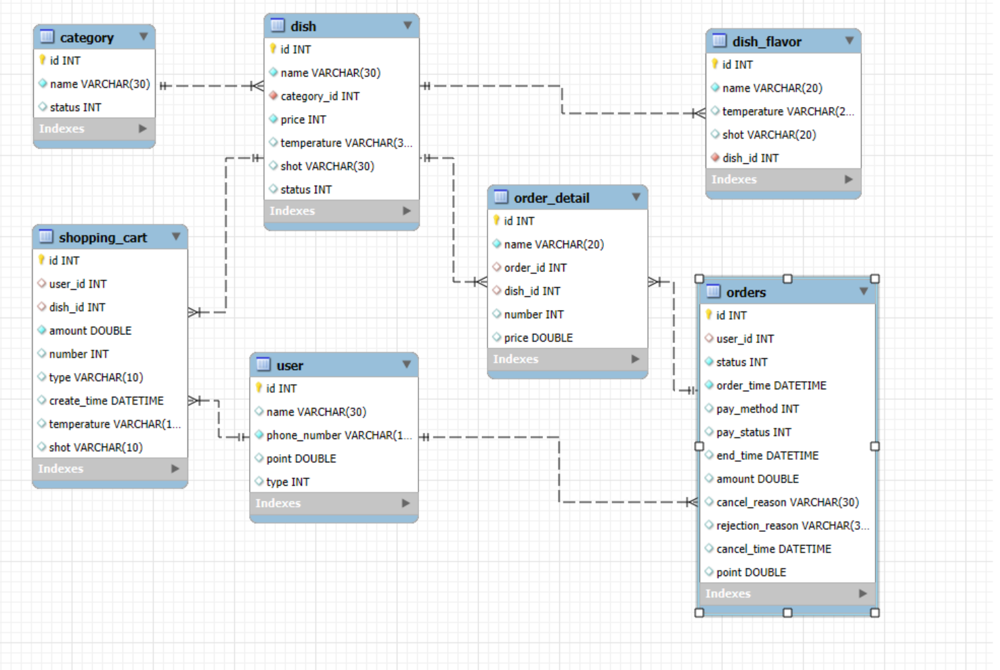

Coffee Kiosk

키오스크를 통한 편리한 주문 및 포인트 적립

2024.11.29 ~ 2024.12.16

-기능-
1. MyBatis를 활용한 my Sql DB 연동
2. 핸드폰번호를 이용한 회원가입 , 포인트 적립 및 사용
3. 카테고리별 음식의 세부 옵션(온도,샷) 설정 후 장바구니 담기
4. 장바구니에 담긴 품목들 결제 후 주문내역 저장

-팀원-

- 조정우 : 설계 담당
- 김유나 : user 관련 user 등록, 포인트적립 및 사용 controller 담당
- 김진홍 : dish/shoppingcart/order controller 담당
- 선근호 : Dto설계 및 View 담당

구현 영상 : https://youtu.be/FIodM0b4syg
